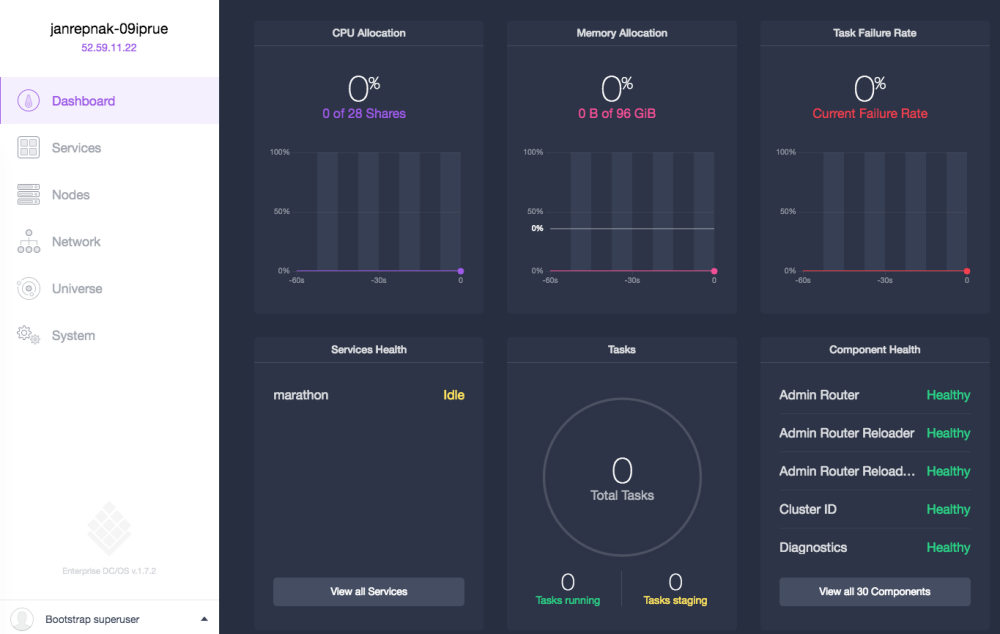

# DCOS Training

You need a computer with Vagrant (https://www.vagrantup.com) and VirtualBox (https://www.virtualbox.org) installed. Please download the ubuntu box ahead of the training with the command `vagrant box add ubuntu/wily64`.

# Container management with Docker and Mesos/Marathon

## Contents

Initiate the vagrant environment `vagrant init ubuntu/xenial64`. Increase the Memory for the vagrant box by adding the following lines to `Vagrantfile`:
```
config.vm.provider "virtualbox" do |vb|
  # Display the VirtualBox GUI when booting the machine
  vb.gui = false

  # Customize the amount of memory on the VM:
  vb.memory = "1024"
end
```

Start the box `vagrant up` and connect to it with `vagrant ssh`.

First of all we install the DCOS CLI: https://docs.mesosphere.com/1.7/usage/cli/install/

```
$ pwd
/home/ubuntu
$ sudo apt-get install python
$ curl -O https://bootstrap.pypa.io/get-pip.py
$ sudo python get-pip.py
$ sudo pip install virtualenv
$ mkdir dcos && cd dcos
$ curl -O https://downloads.dcos.io/dcos-cli/install.sh
$ bash install.sh . http://<instance-name>.us-west-2.elb.amazonaws.com/
$ source /home/ubuntu/dcos/bin/env-setup && dcos help
```
Now clone the repo in the directory where you've installed the CLI. For example, I've installed into `~/dcos/` hence I would do the following.

```
$ pwd
/home/ubuntu/dcos
$ git clone https://github.com/jrx/dcos-training.git
Cloning into 'dcos-training'...
remote: Counting objects: 47, done.
remote: Compressing objects: 100% (29/29), done.
remote: Total 47 (delta 14), reused 47 (delta 14), pack-reused 0
Unpacking objects: 100% (47/47), done.
Checking connectivity... done.
$ ll
total 36
drwxrwxr-x 6 ubuntu ubuntu 4096 Jun 26 12:25 ./
drwxr-xr-x 6 ubuntu ubuntu 4096 Jun 26 12:22 ../
drwxrwxr-x 2 ubuntu ubuntu 4096 Jun 26 12:22 bin/
drwxrwxr-x 8 ubuntu ubuntu 4096 Jun 26 12:25 dcos-training/
-rw-rw-r-- 1 ubuntu ubuntu 5159 Jun 26 12:21 install.sh
drwxrwxr-x 3 ubuntu ubuntu 4096 Jun 26 12:22 lib/
drwxrwxr-x 2 ubuntu ubuntu 4096 Jun 26 12:22 local/
-rw-rw-r-- 1 ubuntu ubuntu   60 Jun 26 12:22 pip-selfcheck.json
```

Going forward, we will call the directory you've installed the DCOS CLI in simply  `$DCOS_CLI_HOME`.

Now check if you can access the DCOS cluster dashboard and you're all set:



The hands on sessions are:

1. [Containers &amp; Docker](./docker)
1. [Mesos &amp; Marathon](./mesos-marathon)
1. [Tweeter](./tweeter)
1. [CI/CD](./cicd)

## Resources

- [DC/OS docs](https://dcos.io/docs/1.7/)
- [Marathon doc](https://mesosphere.github.io/marathon/docs/)
- [Mesos doc](http://mesos.apache.org/documentation/latest/)
