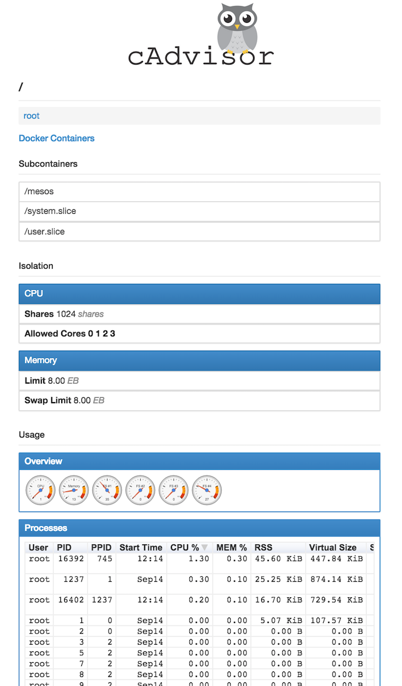
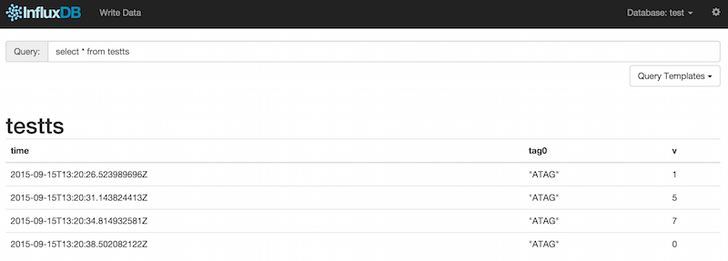
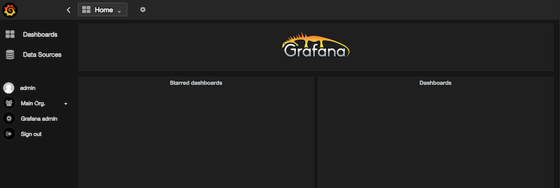

# Advanced: logging with cAdvisor, InfluxDB and Grafana

## Placeholders
- $DCOS_CLI_HOME: DCOS command line tool directory
- $MASTER_IP_ADDRESS: Mesos Master IP address
- $PUBLIC_SLAVE_IP_ADDRESS: Mesos Public Slave IP address

## Step 1: base deployment of cAdvisor
Source: https://github.com/google/cadvisor

Deploy the app in Marathon:

    $ dcos marathon app add marathon-cadvisor.json
    $ dcos marathon app list
    ID          MEM   CPUS  TASKS  HEALTH  DEPLOYMENT  CONTAINER  CMD
    /cadvisor  512.0  0.5    1/1    ---       ---        DOCKER   None

Where does it run?

    $ dcos marathon app show cadvisor | grep -w tasks -A 8
    "tasks": [
      {
        "appId": "/cadvisor",
        "host": "ip-10-0-7-124.us-west-2.compute.internal",
        "id": "cadvisor.550f490d-5ba3-11e5-98ec-6ec316fc94b6",
        "ports": [
          12235
        ],

Note the port (`12235`) and point the browser there (`$PUBLIC_SLAVE_IP_ADDRESS:12235/containers/`):

## Step 2:  InfluxDB

Deploy InfluxDB in Marathon:

    $ dcos marathon app add marathon-influxdb.json

Where does it run?

    $ dcos marathon app show influxdb | grep -w tasks -A 8
    "tasks": [
      {
        "appId": "/influxdb",
        "host": "ip-10-0-7-124.us-west-2.compute.internal",
        "id": "influxdb.3bb5669e-5baa-11e5-98ec-6ec316fc94b6",
        "ports": [
          20316,
          20317
        ],
        
Note the first port (`20316`) and point the browser there (`$PUBLIC_SLAVE_IP_ADDRESS:20316`):

Last step to set up InfluxDB is to change the port to the second port (`20317`).

Create a database called `test` and use the `Write Data` link (in the WebUI) to create some data:

        testts,tag0=ATAG v=1
        testts,tag0=ATAG v=5
        testts,tag0=ATAG v=7
        testts,tag0=ATAG v=0

Then you can query it like so:

        SELECT * FROM testts

Last step is to create an administrator user with `admin`|`admin`. See also the [InfluxDB guide](https://influxdb.com/docs/v0.9/introduction/overview.html).

## Step 3: Grafana

Deploy Grafana in Marathon:

    $ dcos marathon app add marathon-grafana.json
    $ dcos marathon app show grafana | grep -w tasks -A 8
    "tasks": [
    {
      "appId": "/grafana",
      "host": "ip-10-0-7-124.us-west-2.compute.internal",
      "id": "grafana.c393d2af-5bae-11e5-98ec-6ec316fc94b6",
      "ports": [
        21403
      ],

And again, following the same steps as above we discover Grafana running on `$PUBLIC_SLAVE_IP_ADDRESS:21403` (log in with `admin`|`admin`)

Connect InfluxDB to Grafana:

Note: use the second InfluxDB port (in my case `20317`) to configure the datasource. After you've added a dashboard (which I called `cAdvisor`) and a row (using the `test` database from the data source and selected the `testts` measurement) you should see something like this:

See also the [Grafana-InfluxDB setup](http://docs.grafana.org/datasources/influxdb/).

## Step 4: Putting it all together

1. First deploy `marathon-influxdb.json`
1. `CREATE DATABASE ca` and `ALTER RETENTION POLICY default ON ca DURATION 1d`
1. Update `storage_driver_host` args in `marathon-cadvisor-influxdb.json` with the second port (API port) of InfluxDB from step 1.
1. Deploy `marathon-cadvisor-influxdb.json`
1. Deploy and config `marathon-grafana.json`
